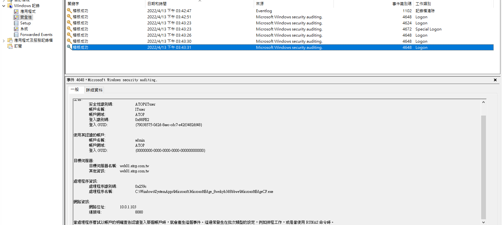

# IIS 結合Windows認證

## 簡述
在內網環境下，基於IIS的asp.net網頁服務常常會結合Windows認證，結合AD以達到單一認證的目的。
但實務上此類的服務常常也是已經潛入內網攻擊者攻擊的對象，本實驗將藉由各種方法及模擬各種場景找到產生問題的
來源與程式。

## 場景敘述

### NTLM
```
false overview(no ntlm between client with browser and domain controller)

https://daiker.gitbook.io/windows-protocol/ntlm-pian/4

[overview](https://siddhivinayak-sk.medium.com/ntlm-based-user-authentication-and-sso-in-web-application-4450eadb2332)
```
```mermaid
sequenceDiagram
Title:NTLM Over HTTP Overview
participant C as Client
participant W as WebServer
Actor DC as DC

C-->>W:HTTP Request
W-->>C:HTTP Unauthorized
C-->>W:HTTP(NTLM Negotiate)
W-->>C:HTTP(NTLM Challenge)
C-->>W:HTTP(NTLM Authorization)
Note right of C:UserName<br>Computer Name(NetBios)<br>Net-NTLM Hash
W->>DC:NetLogon
Note right of DC:User NTLM hash check
DC->>W:Result(Fail)
Note Left of W:Event:4625<br>Username<br>Computer Name(NetBios)
W-->>C:Fail Auth

classDef alexclass fill:#f9f,stroke:#fff,stroke-width:2px;
  class C alexclass;

```


- Case1:使用者使用瀏覽器登入IIS服務所產生紀錄
  - 使用者端產生事件:4648(run as 的log)
    - 可看到產生事件的exe

  - IIS端產生事件: 4625(NTLM)


- Case2:從同網段內KALI攻擊機發起驗證
  - 直接連線網站:
    - 無法驗證，且不會產生security log
  - 由domain內其中一台機器(A)登入domain user和本機帳戶，ssh反向tunnel到攻擊機器單一port
    - IPweb:IPwebport <==> KaliLocal:KaliPort
    - kali browser 訪問 KaliLocal:KaliPort
    - 結果:可發起NTLM驗證，且可成功登入網站
    - 差異:
      - EventLog一樣為4625，IP為機器A的
      - 但機器名稱變為:WorkStation
        - **MDI上會有差異** =>**此場景列入MDI測試**
  


### Kerberos

- 使用IP存取IIS Website:
  - 驗證會降級成NTLM
- 使用FQDN存取:
  - 使用domain不存在的user:降級為NTLM
  - 使用domain存在的user:
    - 登入失敗:未產生任何紀錄
    - kerberos

[IIS with kerberos settings](https://techcommunity.microsoft.com/t5/iis-support-blog/setting-up-kerberos-authentication-for-a-website-in-iis/ba-p/347882)
[IIS with kerberos tools](https://github.com/SurajDixit/KerberosConfigMgrIIS)